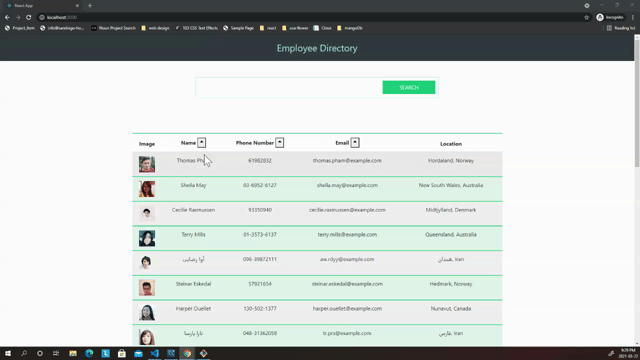

<h1 align="center"> Employee-Directory👋</h1>

 

## Description 

A web application that lists all employees in one directory using React. The user can search employees by their first or last name, or sort the employees by their phone number or email address and name.<h4>Click [here](https://shiva-shiva.github.io/Employee-Directory/) for deployed application.</h4>

## Business Context

An employee or manager would benefit greatly from being able to view non-sensitive data about other employees. It would be particularly helpful to be able to filter employees by name, phone and email address.

## ✨Demo

 ## Table of Contents
* [Description](#Description)
* [Installation](#installation)
* [Usage](#usage)
* [license](#license)

## Installation
*Steps required to install project and how to get the development environment running:*

    1- Clone this repository to your local machine.

    2- Run npm install to install dependencies required for this project.

## 💻usage
*Instructions and examples for use:*  

    Run npm start to start the application.
    To access the app after starting the server, go to http://localhost:3000 in your browser.
    
## Features

    React
    JavaScript library 
    Heroku - Used to deploy application

## 📝License
MIT License 
       

## Questions
 :octocat: Find me on GitHub:[shiva-shiva](https://github.com/shiva-shiva) 
     
    ✉️ Email me with any questions: shivasabokdast@gmail.com  